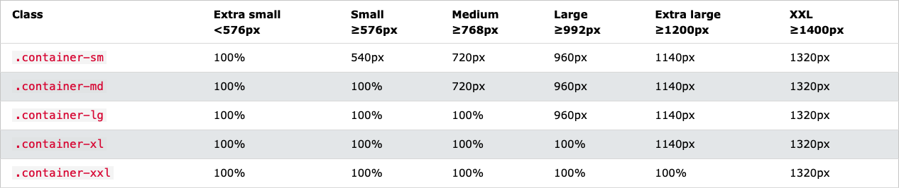
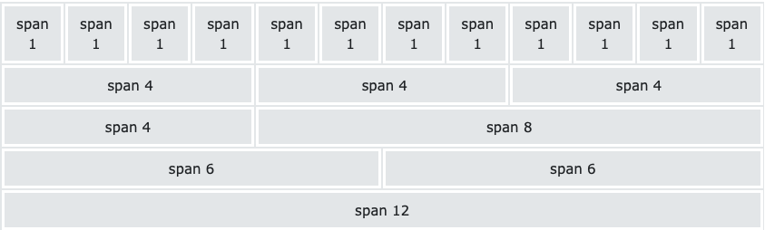

# Bootstrap5

## This repository is designed to learn Bootstrap 5.

## Table of contents

- [Design Links](#links)
- [Development Process](#development-process)
- [Authors](#authors)

### Containers
- .container (responsive fixed width container)
- .container (full width container)
- 

### Grids
- 
- .col- (extra small devices - screen width less than 576px)
- .col-sm- (small devices - screen width equal to or greater than 576px)
- .col-md- (medium devices - screen width equal to or greater than 768px)
- .col-lg- (large devices - screen width equal to or greater than 992px)
- .col-xl- (xlarge devices - screen width equal to or greater than 1200px)
- .col-xxl- (xxlarge devices - screen width equal to or greater than 1400px)

### Text/Typography
- .h1 - .h6 (make any element behave like heading)
- .display-1 - .display-6 (creates a more standing out heading - larger font-size and lighter font-weight)
- .small (creates smaller, secondary text in any heading)
- .mark (style with yellow background color and some padding)
- <abbr> (style with dotted border bottom and question mark cursor on hover)
- .blockquote (quote blocks of content)
  
